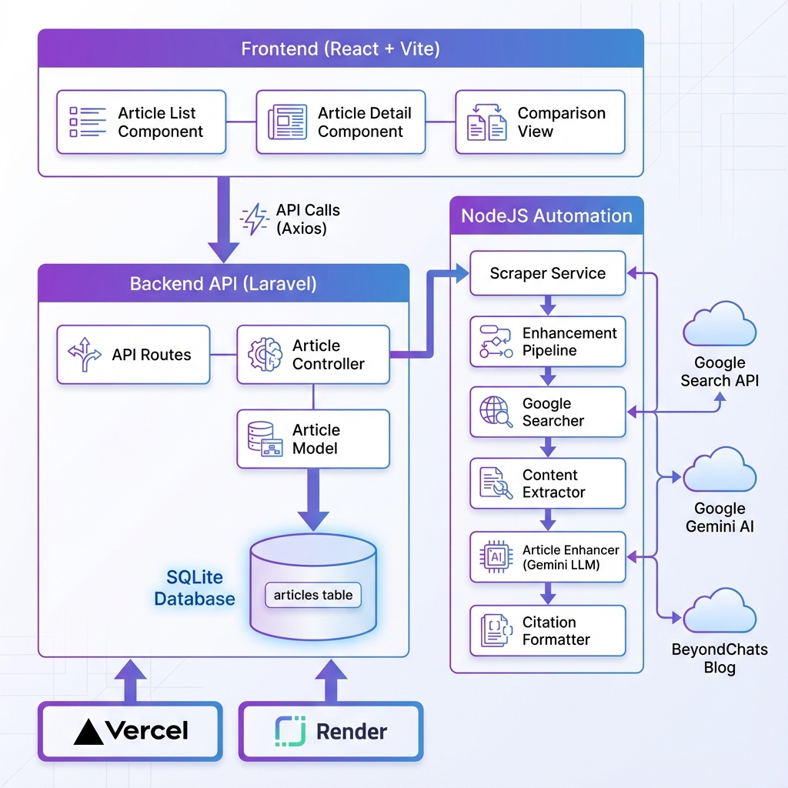

# Architecture Documentation

## System Architecture



## Overview

The BeyondChats Full Stack Application follows a modern monorepo architecture with clear separation of concerns across three main components: Frontend, Backend, and Automation.

---

## Architecture Layers

### 1. Frontend Layer (React + Vite)

**Technology**: React 18, Vite, React Router DOM

**Components**:
- `ArticleList` - Displays paginated list of articles with filtering
- `ArticleDetail` - Shows individual article with metadata
- `ComparisonView` - Side-by-side original vs enhanced content

**Communication**:
- Makes HTTP requests to Backend API via Axios
- Handles loading states and error boundaries
- Implements client-side routing

**Deployment**: Vercel (Global CDN)

---

### 2. Backend Layer (Laravel)

**Technology**: Laravel 12, PHP 8.2, SQLite/MySQL

**Components**:

#### API Layer
- `ArticleController` - Handles CRUD operations
- `API Routes` - RESTful endpoint definitions
- `ArticleResource` - JSON response transformation
- `ArticleCollection` - Paginated response formatting

#### Business Logic
- `BeyondChatsScraper` - Scrapes blog articles
- `Article Model` - Eloquent ORM model
- `Validation Requests` - Input validation

#### Data Layer
- SQLite Database (development)
- MySQL Database (production)
- Migrations & Factories

**Deployment**: Render (Free tier)

---

### 3. Automation Layer (NodeJS)

**Technology**: Node.js 18, ES Modules

**Pipeline Components**:

1. **GoogleSearcher**
   - Searches Google for article titles
   - Extracts top 2 ranking URLs
   - Filters relevant article links

2. **ContentExtractor**
   - Scrapes content from URLs
   - Parses HTML with Cheerio
   - Extracts title, content, metadata

3. **ArticleEnhancer**
   - Integrates with Google Gemini LLM
   - Enhances content quality
   - Generates improved versions

4. **CitationFormatter**
   - Formats citations (Markdown, HTML, JSON)
   - Generates reference links
   - Appends to enhanced content

5. **Enhancement Pipeline**
   - Orchestrates all modules
   - Manages workflow
   - Updates via API

**External Services**:
- Google Search (for article discovery)
- Google Gemini AI (for enhancement)
- BeyondChats Blog (source content)

---

## Data Flow

### Article Creation Flow

```
1. User runs scraper command
   ↓
2. BeyondChatsScraper fetches BeyondChats blog
   ↓
3. Parses HTML to extract articles
   ↓
4. Stores in database via Article Model
   ↓
5. Articles available via API
```

### Enhancement Flow

```
1. User runs enhancement script
   ↓
2. Fetch non-enhanced articles from API
   ↓
3. For each article:
   a. Search Google for title
   b. Extract content from top 2 results
   c. Send to Gemini LLM for enhancement
   d. Format citations
   e. Update article via API
   ↓
4. Enhanced articles available in frontend
```

### User View Flow

```
1. User visits frontend (Vercel)
   ↓
2. React app loads ArticleList
   ↓
3. Fetch articles from Backend API (Render)
   ↓
4. Display with pagination and filters
   ↓
5. User clicks article
   ↓
6. Navigate to ArticleDetail
   ↓
7. User can toggle between:
   - Original content
   - Enhanced content
   - Comparison view
```

---

## Database Schema

### Articles Table

| Column | Type | Description |
|--------|------|-------------|
| id | bigint | Primary key |
| title | string | Article title |
| slug | string | URL-friendly identifier (unique) |
| url | string | Original article URL (unique) |
| excerpt | text | Short summary |
| content | longtext | Original content |
| enhanced_content | longtext | AI-enhanced content |
| author | string | Article author |
| image_url | string | Featured image |
| published_at | datetime | Publication date |
| metadata | json | Additional info (read_time, views, category) |
| citations | json | Reference URLs |
| is_enhanced | boolean | Enhancement status |
| created_at | timestamp | Record creation |
| updated_at | timestamp | Last update |

**Indexes**:
- `slug` (unique)
- `url` (unique)
- `published_at`
- `is_enhanced`

---

## API Design

### RESTful Principles

- **Resources**: Articles
- **HTTP Methods**: GET, POST, PUT, DELETE
- **Response Format**: JSON
- **Status Codes**: 200, 201, 404, 422, 500

### Endpoint Structure

```
GET    /api/articles           - List all articles
POST   /api/articles           - Create article
GET    /api/articles/{slug}    - Get single article
PUT    /api/articles/{slug}    - Update article
DELETE /api/articles/{slug}    - Delete article
GET    /api/articles/{slug}/enhanced - Get enhanced version
```

### Response Format

```json
{
  "success": true,
  "data": { ... },
  "meta": {
    "current_page": 1,
    "total_pages": 5,
    "per_page": 15,
    "total": 72
  },
  "links": {
    "first": "...",
    "last": "...",
    "prev": null,
    "next": "..."
  }
}
```

---

## Security Considerations

### Backend
- ✅ CORS configuration for allowed origins
- ✅ Input validation on all requests
- ✅ SQL injection prevention (Eloquent ORM)
- ✅ XSS protection (output escaping)
- ✅ Environment variable management

### Frontend
- ✅ HTTPS enforcement in production
- ✅ Client-side input validation
- ✅ Error boundary implementation
- ✅ Secure API communication

### Deployment
- ✅ Environment-specific configurations
- ✅ Secrets management (env variables)
- ✅ Automatic HTTPS (Vercel + Render)

---

## Scalability

### Current Architecture
- **Database**: SQLite (development), MySQL (production ready)
- **Backend**: Single instance (Render free tier)
- **Frontend**: Global CDN (Vercel)
- **Caching**: Browser caching, asset optimization

### Future Improvements
- Redis caching for API responses
- Database connection pooling
- Queue system for background jobs
- CDN for media assets
- Horizontal scaling for backend

---

## Monitoring & Logging

### Backend (Render)
- Application logs
- Error tracking
- Performance metrics
- Uptime monitoring

### Frontend (Vercel)
- Deployment logs
- Analytics dashboard
- Core Web Vitals
- Error reporting

### Automation
- Console logging
- Pipeline status tracking
- Error notifications

---

## Technology Choices

### Why Laravel?
- Modern PHP framework with best practices
- Eloquent ORM for database operations
- Built-in API resources
- Excellent testing support

### Why React + Vite?
- Fast development with Hot Module Replacement
- Modern build tool with great performance
- Component-based architecture
- Rich ecosystem

### Why NodeJS for Automation?
- Async I/O for web scraping
- Great library ecosystem (Axios, Cheerio)
- Easy integration with LLM APIs
- JavaScript uniformity with frontend

### Why Render + Vercel?
- Free tier for development/portfolio
- Automatic deployments from Git
- Built-in HTTPS
- Easy environment management

---

## Deployment Architecture

```
GitHub Repository
       ↓
   ┌───┴───┐
   ↓       ↓
Render   Vercel
(Backend)(Frontend)
   ↓       ↓
Production URLs
```

**Auto-deployment**: Push to `main` branch triggers deployment on both platforms

---

## Development Workflow

1. **Local Development**
   - Backend: `php artisan serve` (port 8000)
   - Frontend: `npm run dev` (port 5173)
   - Automation: `npm start`

2. **Testing**
   - Backend: `php artisan test`
   - Integration: Manual testing

3. **Deployment**
   - Commit to `main` branch
   - Automatic deployment to Render + Vercel
   - Verify both environments

---

## Conclusion

This architecture provides:
- ✅ Clear separation of concerns
- ✅ Scalable foundation
- ✅ Modern development practices
- ✅ Production-ready deployment
- ✅ Easy maintenance and updates

For more details, see:
- [API Documentation](API.md)
- [Setup Guide](SETUP.md)
- [Deployment Guide](../DEPLOYMENT.md)
